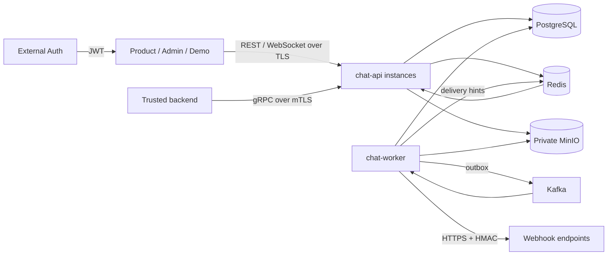

# Архитектура Universal Chat Service

Статус: архитектура MVP из Phase 0. Реализован bootstrap 1.1 и infrastructure 1.2:
cmd/api/worker/migrate/minio-init, config/logging/httpserver, PostgreSQL/Redis/Kafka/MinIO adapters.
Development Compose/Dockerfiles добавлены в 1.3; identity/auth/provisioning — в 1.4.
HTTP identity transport → application interfaces → PostgreSQL repository. Внешний JWT
проверяется через Auth; роли принадлежат Chat DB (D32), RS256 оставлен для offline dev fixture.
В 1.5 добавлены policy application/repository/transport и Redis/CORS admission middleware.
Foundation 1.6 завершён: Swagger UI/spec embedded, unit/integration/API acceptance.
Phase 2–4 реализованы: private conversations/memberships, AES-GCM messages, blind search,
transactional event log/outbox, Kafka→Redis router, WS/recovery/checkpoints/presence/typing.
Шаги 5.1–5.2 добавляют reply/edit/delete и отдельные relations reactions/pins (migration 10).
Все изменения message state используют общий resource_version и transactional reference events;
authorized recovery гидратирует актуальный Message, включая relations или terminal tombstone.
Точный текущий контракт: [Messages](docs/MESSAGES.md), [Realtime](docs/REALTIME.md).
Остальные возможности Phase 5–10 ниже остаются архитектурным планом.
Основание: [ТЗ](docs/REQUIREMENTS.md), [решения](DECISIONS.md), [план](IMPLEMENTATION_PLAN.md).
Проект создаётся с нуля; совместимость с удалённым прототипом не требуется.

## Назначение и границы

Самостоятельный backend чата для нескольких внешних приложений. Единственный термин интеграции —
**Project**. Chat Service не регистрирует пользователей и не управляет их паролями: внешний Auth
выдаёт JWT, сервис проверяет его и связывает `(project_id, external_user_id)` с внутренним UUID.
Admin и Demo проверяют возможности backend; не являются основным продуктом или UI-библиотекой.

MVP — modular monolith, один Go module и два процесса из одного codebase:

- `chat-api`: REST, WebSocket, минимальный внутренний gRPC, управление sessions/presence;
- `chat-worker`: outbox, Kafka consumers, webhook deliveries, Echo Bot, retention/cleanup.

PostgreSQL хранит долговечное состояние. Redis хранит presence, connections, typing, rate limits
и обеспечивает межпроцессную сигнализацию. Kafka переносит backend events; MinIO хранит файлы.
Notification Service, Kubernetes, E2EE и дополнительные media types вне MVP.



## Модули и зависимости

| Модуль | Ответственность |
| --- | --- |
| auth, projects, users | Проверенный Actor, provisioning, profiles, project config |
| conversations, channels | DIRECT/GROUP/CHANNEL, membership, роли, доступ |
| messages, reactions, search | Сообщения, sequence, dedup, история, поиск, связанные действия |
| attachments | Upload lifecycle, проверка файлов, авторизованная выдача |
| websocket, presence | Protocol/session/hub, device mapping, TTL, typing |
| moderation, reports, audit | Blacklist, bans, жалобы, журнал административных действий |
| integrations, api_keys, feature_flags | Service actors, scopes, настройки Project |
| bots, webhooks | Bot identity, Echo Bot, подписки, асинхронные доставки |
| admin | Административные use cases; использует те же доменные политики |

Channels — поведение типа conversation, не отдельное хранилище сообщений. Модуль не обязан иметь
отдельный каталог до появления собственного поведения. Границы вводятся по ответственности,
без пустых пакетов/интерфейсов для каждого типа.

Transport преобразует запрос в command/query. Application service проверяет Actor, Project,
membership, ban, flags и лимиты; выполняет use case через repositories/transaction boundary.
Domain/application не импортируют router, pgx, Kafka client, Redis client или MinIO SDK.
Adapters реализуют необходимые интерфейсы; composition root собирает зависимости.
Внутренний вызов бота/gRPC не обходит application services.

## Целевое дерево

Это план, а не уже созданные заглушки. Каталоги появляются с реализацией своей фазы.

```text
cmd/
  api/              # HTTP/WS/gRPC process
  worker/           # durable background jobs
  migrate/          # migration command
  dev-token/        # development only
  seed/             # development only
  project/          # operator provisioning, no public registration
internal/
  auth/ projects/ users/ conversations/ channels/
  messages/ reactions/ search/ attachments/
  websocket/ presence/ moderation/ reports/
  bots/ webhooks/ integrations/ api_keys/ feature_flags/ audit/ admin/
  platform/
    config/ logging/ postgres/ redis/ kafka/ minio/ encryption/ http/ grpc/
migrations/
api/
  openapi/ asyncapi/ proto/
web/
  admin/ demo/       # Vue 3 + TypeScript + Vite
tests/integration/
deploy/             # Dockerfiles and local supporting configuration
docs/REQUIREMENTS.md
compose.yaml        # local environment from repository root
.env.example
go.mod
README.md
```

## Изоляция и доступ

Каждый вход проходит authentication. Доверенный Actor содержит project_id, actor_type, actor_id,
external_user_id при наличии, global roles/scopes. Project не выбирается по непроверенному header
или client payload. Если маршрут содержит project_id, он обязан совпадать с проверенным context.
Текущий remote API обслуживает AUTH_PROJECT_ID из серверной конфигурации; Auth возвращает
только идентичность. Role user/admin берётся из профиля Chat отдельно в каждом Project.

Repository methods требуют ProjectID явно; SQL фильтрует project_id даже при UUID lookup.
Composite FK и UNIQUE защищают связанные сущности от межпроектных ссылок. Redis keys, MinIO keys,
events и idempotency scoped по Project. Подробности: [DB schema](DB_SCHEMA.md), [security](SECURITY.md).

Membership обязательна в обычном chat API, включая admin как обычного участника. Project admin
читает/модерирует ресурсы через отдельный admin API с audit, а не через скрытый обход проверок.
Global ban запрещает доменные записи, сохраняя доступ к ранее разрешённому чтению.

## Транзакция отправки

1. Аутентифицировать и нормализовать запрос; ограничить размер и скорость.
2. В транзакции получить Project/actor policy locks и проверить глобальные restrictions.
3. Зарезервировать `(project_id, sender_id, client_message_id)` и сверить fingerprint повторного запроса.
4. Заблокировать conversation/membership и нужные resources, проверить права, flags/blacklist,
   затем выделить следующий `message_sequence` и `event_sequence`.
5. Сохранить encrypted message, search tokens, attachment relations, changefeed event и outbox.
6. Commit; только теперь вернуть SENT. При неизвестном результате commit клиент повторяет тот же ID.
7. Worker публикует событие; API instances доставляют актуальное состояние разрешённым sessions.

В обработчиках не существует ветки «commit в PostgreSQL, затем единственный publish в Kafka».
Падение Kafka задерживает realtime, но не уничтожает сообщение. При failover PostgreSQL гарантия
определяется durability deployment: локальный одноузловой Compose не обещает пережить потерю диска.

## Порядок, changefeed и восстановление

У conversation два разных монотонных счётчика:

- `message_sequence` — только новые сообщения; история сортируется по нему;
- `event_sequence` — все долговечные conversation changes, включая edits/deletes/reactions/read.

`conversation_events` — durable changefeed с references и resource_version. Это не Event Sourcing:
актуальное состояние читается из обычных таблиц, восстановление всей модели из событий не требуется.
Outbox — очередь публикации и очищается независимо от срока changefeed.

Replay сообщает изменения и гидратирует текущее доступное состояние. Старый event не должен
раскрывать удалённый content. Клиент применяет resource_version монотонно; при истечении retention
курсор приводит к `RESYNC_REQUIRED`, затем к согласованному snapshot. Details — [WS](WEBSOCKET_PROTOCOL.md).

## Несколько instances и фоновые процессы

Kafka consumer group `realtime-router` получает события и публикует Redis hints по Project/conversation.
Каждая API instance подписана на hints и доставляет события своим локальным sessions.
Consumer group распределяет сообщения между workers; API instances не используют одну Kafka group
как broadcast. Redis хранит connection_id → instance/device/user с TTL и обратный user mapping.

Redis hints могут теряться. Пока session активна, API периодически сверяет её event cursor с
PostgreSQL (начальный интервал 5 секунд); reconnect всегда восстанавливается из БД. Клиентская
дедупликация и resource_version обязательны. DB poll ограничивается активными conversations,
с batching и jitter. Полный polling history не используется.

Workers координируются PostgreSQL locks/leases; outbox сериализуется по aggregate, webhook delivery
имеет lease, retries и уникальность; consumers дедуплицируются в одной транзакции с local side effects.
Echo Bot отправляет детерминированный client_message_id, предотвращая повторный ответ.

## Эксплуатация

Текущий шаг 1.2 проверяет **все четыре** инфраструктурные зависимости для readiness обеих ролей.
Это консервативная infrastructure probe до появления business routes; целевая политика
degraded capabilities ниже вводится вместе с ними. Подробности: [Foundation 1.2](docs/INFRASTRUCTURE.md).

- PostgreSQL durable commit, private MinIO, Redis TTL; ни Redis, ни Kafka не заменяют историю БД.
- Liveness не проверяет сеть; readiness показывает готовность API сохранять/читать данные.
  PostgreSQL, валидная auth/encryption config и Redis обязательны для защищённых write paths;
  сбой Kafka/MinIO отражается отдельной degraded capability, без фиктивной общей готовности upload.
- HTTP/WS имеют timeouts, bounds и graceful drain. Shutdown останавливает admission,
  закрывает sessions, отменяет loops и завершает/откатывает транзакции в ограниченное время.
- slog: request_id/event_id/connection_id без content и секретов. Метрики-стек пока не требуется.
- Retention default 365 дней; delete jobs повторяемые. Файлы удаляются после безопасного удаления
  всех references, через durable cleanup queue; новая ссылка на pending-delete object запрещена.
- Compose наращивается по фазам. Финальный состав: postgres, redis, kafka (KRaft), minio,
  minio-init, chat-api, chat-worker, admin-web, demo-web. Production TLS/HA/backup — отдельная настройка.

## Документальные границы MVP

Расширения типов сообщений, key rotation, новых ролей и Notification Service предусмотрены
контрактами. Не создавать действующие endpoints со stub success для будущих возможностей.
Версии инструментов/образов фиксируются и проверяются в Foundation, без floating latest.
Политики и принятые компромиссы перечислены в [DECISIONS.md](DECISIONS.md).
